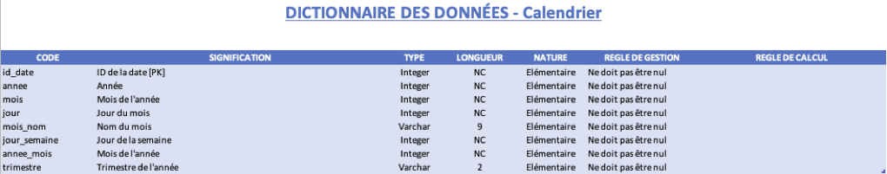
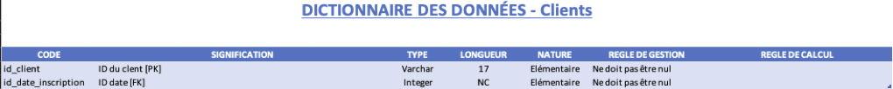
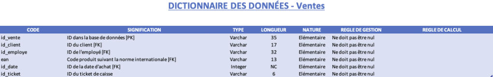
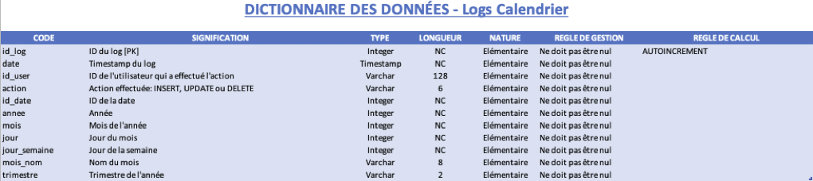
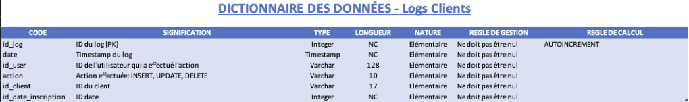
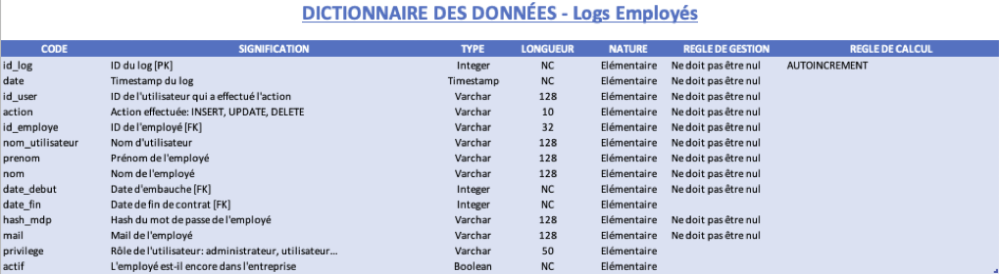
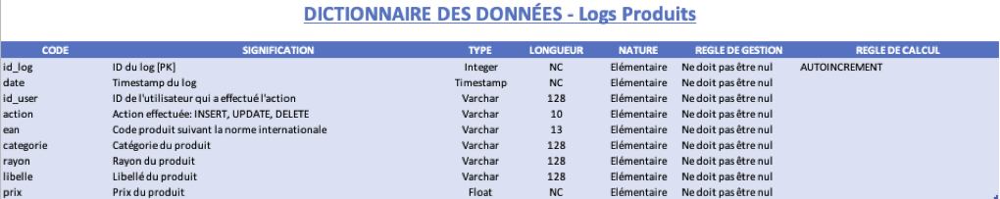
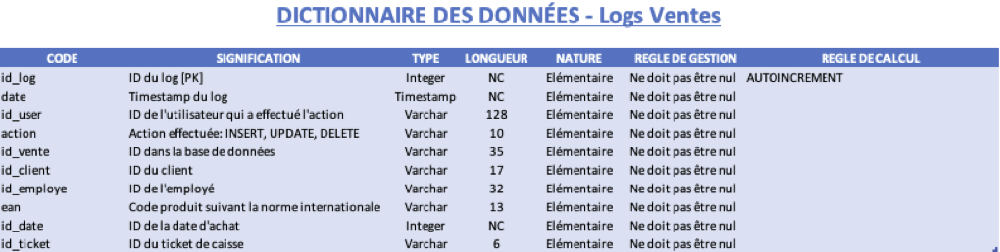
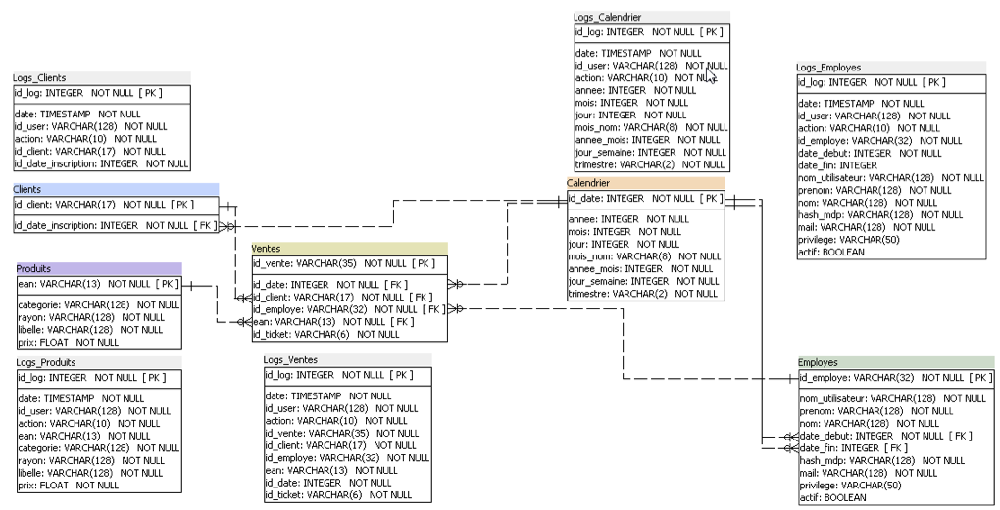

# Recherche d'incohérences dans les données

Ce projet recherche les incohérences dans le jeu de données d'une société et propose des améliorations

## Prérequis

- python3
- sqlite3

## Structure principale du projet

```
├── create_db.sh             # Script d'initialisation de la base de données
├── notebook.ipynb           # Notebook python contenant l'analyse
├── results.pdf              # Résultats d'analyse
```

## Installation

1. **Cloner le dépôt**

```bash
git clone https://github.com/nau81000/data_inconsistency.git
cd data_inconsistency
```

2. **Installer poetry**

```bash
curl -sSL https://install.python-poetry.org | python3 -
```

3. **Créer l'environnement (installer les dépendances)**

```bash
poetry install --no-root
```

4. **Utiliser le notebook python dans un navigateur**

```bash
jupyter lab notebook.ipynb
```

5. **Dicitionnaire des données proposé**


















6. **Nouveau schéma relationnel normalisé proposé**


